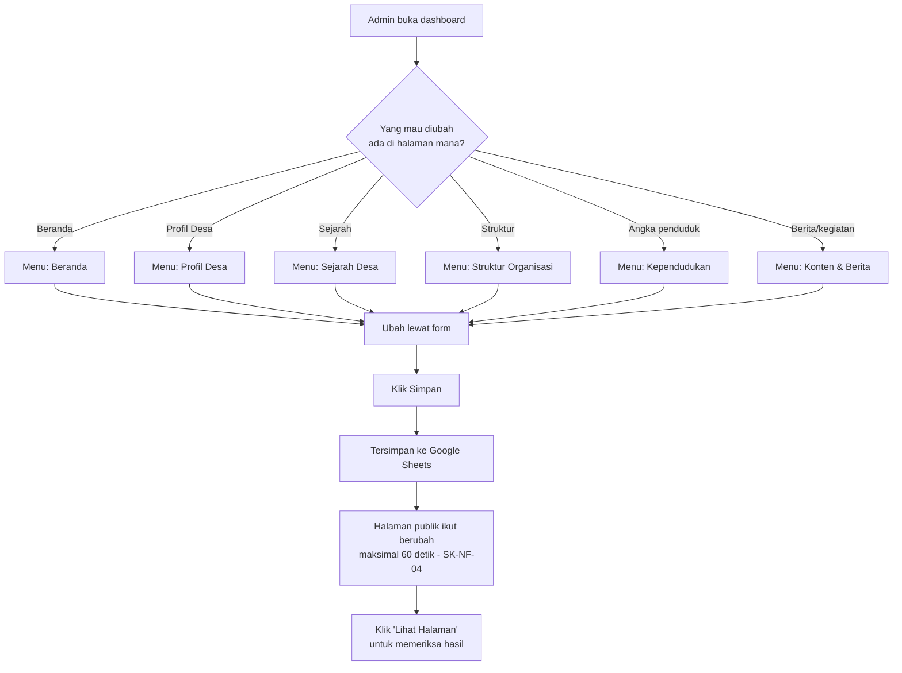
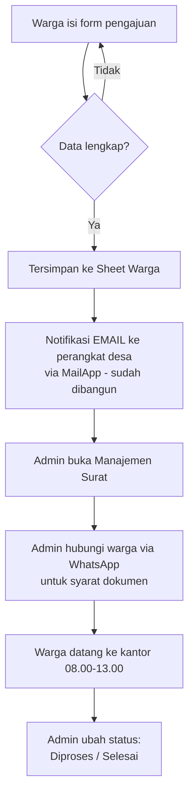
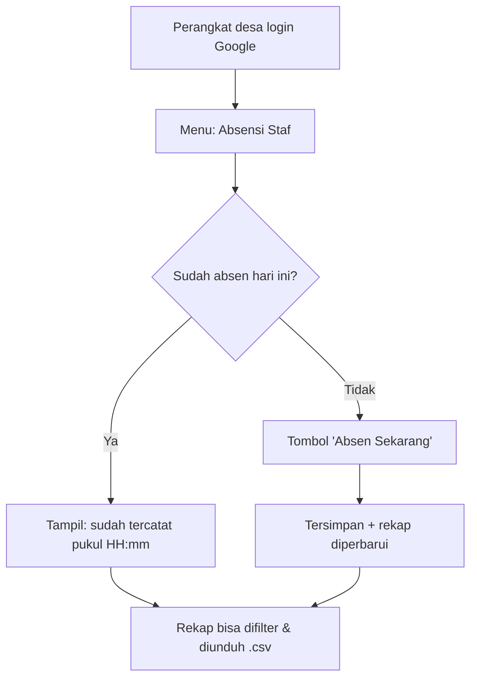

# Analisis Cakupan CMS & Alur Kerja Admin

Dokumen ini memetakan **setiap blok konten** pada mockup halaman publik ke
tempat perangkat desa mengubahnya di panel admin — lalu menandai mana yang
belum punya rumah.

Permintaan desa: *"admin panel punya CMS untuk semua konten itu, supaya tidak
perlu ngoding — cukup ubah semuanya lewat dashboard."* Artinya **tidak boleh ada
teks, angka, atau gambar di halaman publik yang hanya bisa diubah dengan
mengedit kode.**

---

## 1. Ringkasan kondisi saat ini

| Lapisan | Status |
|---|---|
| Panel admin — modul layanan (surat, buku tamu, absensi, pengguna) | Selesai |
| Panel admin — **CMS halaman publik** (7 modul baru) | **Selesai** (update 2026-07-20) |
| Halaman publik (6 halaman) | **Masih stub** — belum dibangun (dikerjakan setelah CMS) |

> **Update 2026-07-20.** Seluruh CMS di tabel §2 sudah dibangun dengan data
> contoh dan tersambung ke server action + Apps Script backup. Yang belum:
> halaman publiknya sendiri (dikerjakan pada tahap berikutnya sesuai keputusan
> "semua CMS dulu"). Modul `Konten & Berita` yang lama tetap menangani berita &
> kegiatan; hero, visi-misi, sejarah, geografi, struktur, dan demografi rinci
> kini punya modulnya masing-masing.

---

## 2. Peta konten → modul admin

Legenda: ✅ sudah tercakup · ⚠️ tercakup sebagian · ❌ belum ada CMS-nya

### Beranda (mockup 1)

| Blok konten | Isi di mockup | CMS | Modul |
|---|---|---|---|
| Eyebrow hero | "DESA WISATA & BUDAYA" | ❌ | *Beranda* (baru) |
| Judul hero | "Sumberagung, Desa yang **Tumbuh** dari Sumber Kehidupan." | ❌ | *Beranda* (baru) |
| Subteks hero | "Terletak di kaki gunung…" | ❌ | *Beranda* (baru) |
| Tombol CTA | "AJUKAN SURAT", "LIHAT KEGIATAN" + tautannya | ❌ | *Beranda* (baru) |
| Gambar latar hero | ilustrasi gunung & danau | ❌ | *Beranda* (baru) |
| Bar statistik | 4.521 / 1.204 / 42 / 12 | ✅ | Kependudukan |
| Judul seksi kegiatan | "Jejak Langkah & Geliat Desa" + subteks | ❌ | *Beranda* (baru) |
| 3 kartu kegiatan | kategori + judul + foto | ✅ | Konten Website |
| Seksi video | judul "Profil Desa", subteks, URL video | ❌ | *Beranda* (baru) |
| Footer: tagline | "Mewujudkan pelayanan publik…" | ❌ | Pengaturan (perluas) |
| Footer: Tautan Cepat | Kontak, Peta Desa, Transparansi, Bantuan | ❌ | Pengaturan (perluas) |
| Footer: Hubungi Kami | alamat + email | ⚠️ | Pengaturan — alamat & email ada, belum dipakai footer |

> **Catatan penting — angka tidak konsisten di mockup.** Bar statistik Beranda
> menulis **4.521** penduduk, sedangkan halaman Demografi menulis **2.704**
> total populasi. Keduanya tidak bisa benar bersamaan. Perlu dikonfirmasi angka
> resmi mana yang dipakai; setelah CMS jalan, satu angka ini akan otomatis
> dipakai di kedua tempat sehingga tidak bisa berbeda lagi.

### Sejarah Desa (mockup 2)

| Blok konten | Isi di mockup | CMS | Modul |
|---|---|---|---|
| Judul & subteks halaman | "Sejarah Desa" + "Perjalanan waktu…" | ❌ | *Sejarah* (baru) |
| Entri timeline | 4 entri: era, subjudul, narasi, foto, sisi kiri/kanan | ❌ | *Sejarah* (baru) |

Timeline harus bisa **ditambah, diubah, dihapus, dan diurutkan** — desa akan
menambah era baru seiring waktu.

### Profil Desa — Visi & Misi (mockup 3)

| Blok konten | Isi di mockup | CMS | Modul |
|---|---|---|---|
| Judul & subteks halaman | "Profil Desa" + narasi | ❌ | *Profil* (baru) |
| Kartu Visi | kutipan "Mewujudkan Sumberagung yang…" | ❌ | *Profil* (baru) |
| Daftar Misi | Misi 01 / 02 / 03 (jumlah bisa berubah) | ❌ | *Profil* (baru) |

### Profil Desa — Demografi (mockup 4)

| Blok konten | Isi di mockup | CMS | Modul |
|---|---|---|---|
| 3 kartu statistik | Total 2.704 · L 1.393 (51,5%) · P 1.311 (48,5%) | ✅ | Kependudukan (persentase dihitung) |
| Tabel Distribusi Usia & Gender | 6 baris rentang usia × L/P/jumlah | ❌ | Kependudukan (**perluas**) |
| Tingkat Pendidikan | SD 45% · SMP 28% · SMA 18% · Sarjana 9% | ❌ | Kependudukan (**perluas**) |
| Luas Wilayah | 646,49 Hektar + foto | ❌ | *Geografi* (baru) |
| Label "Update: Jan 2025" | tanggal pembaruan data | ❌ | Kependudukan (**perluas**) |

> Modul Kependudukan saat ini menyimpan `tahun, totalPenduduk, lakiLaki,
> perempuan, jumlahKK, jumlahRt, jumlahRw` — cukup untuk bar statistik Beranda
> dan 3 kartu di atas, **tapi belum** untuk tabel usia dan grafik pendidikan.

### Profil Desa — Geografi (mockup 5)

| Blok konten | Isi di mockup | CMS | Modul |
|---|---|---|---|
| Letak astronomis | koordinat lintang & bujur | ❌ | *Geografi* (baru) |
| Narasi topografi | "Desa Sumberagung terbentang…" | ❌ | *Geografi* (baru) |
| Ketinggian & posisi | 300 mdpl · Dataran Tinggi | ❌ | *Geografi* (baru) |
| Gambar peta topografi | visualisasi | ❌ | *Geografi* (baru) |
| Batas wilayah | Utara/Selatan/Timur/Barat: desa + kecamatan | ❌ | *Geografi* (baru) |
| Statistik luas lahan | total 646,499 Ha · tanah kering 482,499 · hutan negara 131 · sawah 13 | ❌ | *Geografi* (baru) |

> **Kemungkinan salah ketik di mockup.** Bujur tertulis `118°10'-111°40' Bujur
> Timur`. Angka 118° berada di **timur** 111°, jadi rentangnya terbalik — dan
> Kabupaten Blitar sebenarnya ada di sekitar **112° BT**. Dugaan: seharusnya
> `112°10'–112°40'`. Perlu dicek ke data resmi desa sebelum tayang.
>
> Angka luas juga beda tipis antar halaman: Demografi menulis `646,49`,
> Geografi menulis `646,499`. Setelah masuk CMS, cukup satu sumber angka.

### Struktur Organisasi (mockup 6)

| Blok konten | Isi di mockup | CMS | Modul |
|---|---|---|---|
| Judul & subteks halaman | "Struktur Organisasi" + narasi | ❌ | *Struktur* (baru) |
| 11 kartu jabatan | foto, nama jabatan, nama pejabat | ❌ | *Struktur* (baru) |
| Garis hierarki | BPD ⇢ Kepala Desa → Sekdes → Kasi/Kaur → Kamituwo | ❌ | *Struktur* (baru) |

> **Jangan disamakan dengan modul Pengguna.** Modul Pengguna mengelola *akun
> login* perangkat desa. Struktur organisasi memuat orang yang **belum tentu
> punya akun** — BPD dan Kamituwo di mockup tidak perlu akses dashboard. Dua hal
> berbeda, jadi butuh modul sendiri; kalau digabung, menghapus akun login akan
> ikut menghapus orangnya dari bagan publik.
>
> Perlu dicatat juga: mockup menulis **Slamet Riyadi sebagai Kepala Desa** dan
> **Sutrisno sebagai Kasi Kesejahteraan**, sedangkan data contoh di kode saat ini
> menulis sebaliknya (Sutrisno = Kepala Desa). Data contoh akan diganti data
> asli, tapi perlu dipastikan mana yang benar.

### Navigasi & global

| Blok konten | CMS | Modul |
|---|---|---|
| Label menu navbar | ❌ | Pengaturan (perluas) — SRS memberi Super Admin hak "kelola struktur navigasi" |
| Logo & nama situs | ❌ | Pengaturan (perluas) |
| Identitas desa (kec./kab./prov.) | ✅ | Pengaturan |
| Jam layanan 08.00–13.00 | ✅ | Pengaturan |

---

## 3. Status pembangunan

| # | Pekerjaan | Status |
|---|---|---|
| 1 | Modul **Beranda** (hero, seksi, video, footer) | ✅ Selesai |
| 2 | Modul **Profil** (visi & misi) | ✅ Selesai |
| 3 | Modul **Geografi** (koordinat, batas, luas lahan) | ✅ Selesai |
| 4 | Perluas **Kependudukan** (usia × gender, pendidikan) | ✅ Selesai |
| 5 | Modul **Sejarah** (timeline CRUD + urutan) | ✅ Selesai |
| 6 | Modul **Struktur Organisasi** (bagan + foto) | ✅ Selesai |
| 7 | Perluas **Pengaturan** (footer, navigasi, logo) | ✅ Selesai |
| 8 | **6 halaman publik** dari stub → sesuai mockup | ⏳ Belum — tahap berikutnya |

Di luar CMS (update 2026-07-20): notifikasi surat kini lewat **email**
(`MailApp`, gratis) menggantikan WhatsApp; field `alamat` + `noWa` sudah
ditambahkan ke Pengajuan Surat; absensi kini menyertakan **foto bukti +
lokasi** dengan foto tersimpan di Drive (Sheet menyimpan tautannya).

### Pola arsitektur yang dipakai

Supaya 7 modul konsisten & mudah dirawat, ada beberapa bagian bersama:

- `lib/kv-content.ts` — get/post record "satu kolom kunci-nilai" (Beranda, Geografi, Profil-visi, Pengaturan).
- `lib/ordered.ts` — logika tukar-urutan & nomor urut berikutnya untuk daftar berurut.
- `shared/components/cms/RecordForm.tsx` — form Pola A (satu record), dipakai Beranda/Profil/Geografi.
- `shared/components/cms/OrderedListManager.tsx` — daftar Pola B dengan tambah/ubah/hapus + ↑↓, dipakai Misi/Sejarah/Distribusi Usia/Pendidikan.
- `shared/components/cms/CmsHeader.tsx` — header + tombol "Lihat Halaman".
- Struktur Organisasi memakai manajer khusus (bukan `OrderedListManager`) karena urutannya 2 dimensi: per-level lalu dalam level.

---

## 4. Alur kerja admin

### 4.1 Prinsip navigasi

Supaya perangkat desa tidak bingung "ini diubah di mana", panel admin dibagi
dua kelompok menu yang dipisah garis:

```
LAYANAN                        ← pekerjaan harian, datanya masuk dari warga
  Dashboard
  Manajemen Surat
  Buku Tamu
  Absensi Staf

ISI WEBSITE                    ← mengubah yang dilihat publik
  Beranda
  Profil Desa
  Sejarah Desa
  Struktur Organisasi
  Kependudukan
  Konten & Berita
  Galeri

SISTEM                         ← khusus Super Admin
  Pengguna
  Pengaturan
```

Aturannya: **satu halaman publik = satu menu admin dengan nama yang sama.**
Admin yang ingin mengubah halaman Sejarah mencari menu "Sejarah Desa" — tidak
perlu tahu bahwa isinya disimpan di sheet mana.

### 4.2 Alur "saya mau mengubah sesuatu di halaman publik"



### 4.3 Tiga pola form, dipakai konsisten

Semua modul CMS memakai salah satu dari tiga pola ini saja. Begitu admin paham
satu pola, modul lain langsung terasa familiar:

| Pola | Untuk | Contoh | Cara pakai |
|---|---|---|---|
| **A. Form tunggal** | konten yang cuma ada satu | hero, visi, geografi, pengaturan | Buka → ubah field → Simpan |
| **B. Daftar + form** | konten berulang | berita, galeri, misi, timeline, jabatan | Daftar di bawah, tombol + Tambah, tiap baris ada Ubah / Hapus |
| **C. Tabel angka** | statistik per periode | kependudukan per tahun | Baris per tahun, Ubah untuk menimpa |

Pola B juga memegang **urutan tampil** (timeline sejarah, urutan misi) lewat
tombol naik/turun, bukan kolom angka yang harus diketik manual.

### 4.4 Alur pengajuan surat (SRS 3.2 A) — sudah berjalan



### 4.5 Alur absensi harian — sudah berjalan



### 4.6 Siapa boleh apa

| Aksi | Admin | Super Admin |
|---|---|---|
| Absen sendiri, lihat rekap | ✅ | ✅ |
| Proses pengajuan surat, buku tamu | ✅ | ✅ |
| Ubah isi halaman publik (semua modul CMS) | ✅ | ✅ |
| Kelola akun perangkat desa | ❌ | ✅ |
| Ubah pengaturan sistem & navigasi | ❌ | ✅ |

Dijaga `requireAdmin()` / `requireSuperAdmin()` di **setiap** server action —
bukan hanya disembunyikan di UI, karena server action bisa dipanggil lewat POST
langsung.

---

## 5. Yang perlu dikonfirmasi ke desa

1. **Jumlah penduduk** — 4.521 (Beranda) atau 2.704 (Demografi)?
2. **Koordinat bujur** — `118°10'–111°40'` terbalik & tidak cocok dengan letak Blitar; apakah maksudnya `112°10'–112°40'`?
3. **Luas wilayah** — 646,49 atau 646,499 Ha?
4. **Kepala Desa** — Slamet Riyadi (mockup) atau Sutrisno (data contoh kode)?
5. **Foto** — semua foto (hero, timeline, struktur, kegiatan) diunggah ke Google Drive desa lalu tautannya dipasang di CMS. Perlu satu folder Drive khusus yang di-set "Anyone with the link can view".
